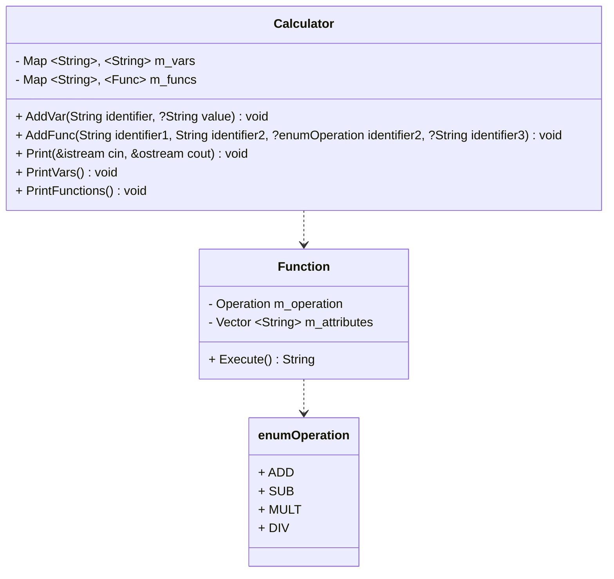

```mermaid
    classDiagram
        Calculator ..> Function
        Function ..> enumOperation
    
        class enum Operation {
            + ADD
            + SUB
            + MULT
            + DIV
        }
    
        class Function {
            - Operation m_operation
            - Vector ~String~ m_attributes
            + Execute() String
        }
    
        class Calculator {
            - Map ~String~, ~String~ m_vars
            - Map ~String~, ~Func~ m_funcs
            + AddVar(String identifier, ?String value) void
            + AddFunc(String identifier1, String identifier2, ?enumOperation identifier2, ?String identifier3) void
            + Print(&istream cin, &ostream cout) void
            + PrintVars() void
            + PrintFunctions() void
        }
```