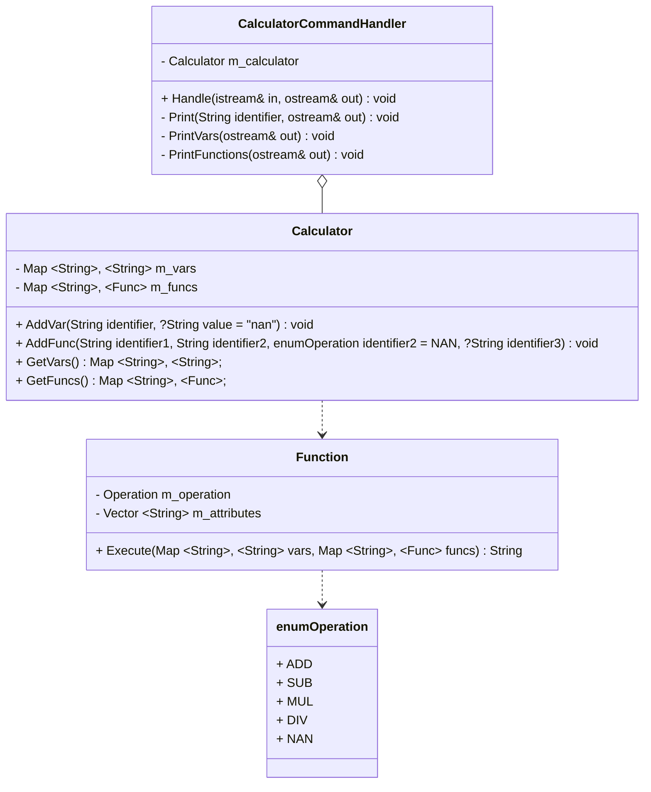

```mermaid
classDiagram
    CalculatorCommandHandler o-- Calculator
    Calculator ..> Function
    Function ..> enumOperation

    class enum Operation {
        + ADD
        + SUB
        + MUL
        + DIV
        + NAN
    }

    class Function {
        - Operation m_operation
        - Vector ~String~ m_attributes
        + Execute(Map ~String~, ~String~ vars, Map ~String~, ~Func~ funcs) String
    }

    class Calculator {
        - Map ~String~, ~String~ m_vars
        - Map ~String~, ~Func~ m_funcs
        + AddVar(String identifier, ?String value = "nan") void
        + AddFunc(String identifier1, String identifier2, enumOperation identifier2 = NAN, ?String identifier3) void
        + GetVars() Map ~String~, ~String~;
        + GetFuncs() Map ~String~, ~Func~;
    }

    class CalculatorCommandHandler {
        - Calculator m_calculator
        + Handle(istream& in, ostream& out) void
        - Print(String identifier, ostream& out) void
        - PrintVars(ostream& out) void
        - PrintFunctions(ostream& out) void
    }
```